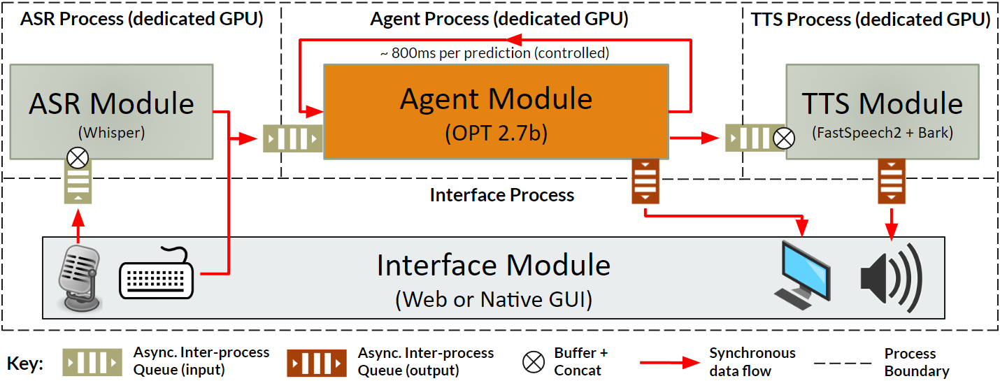
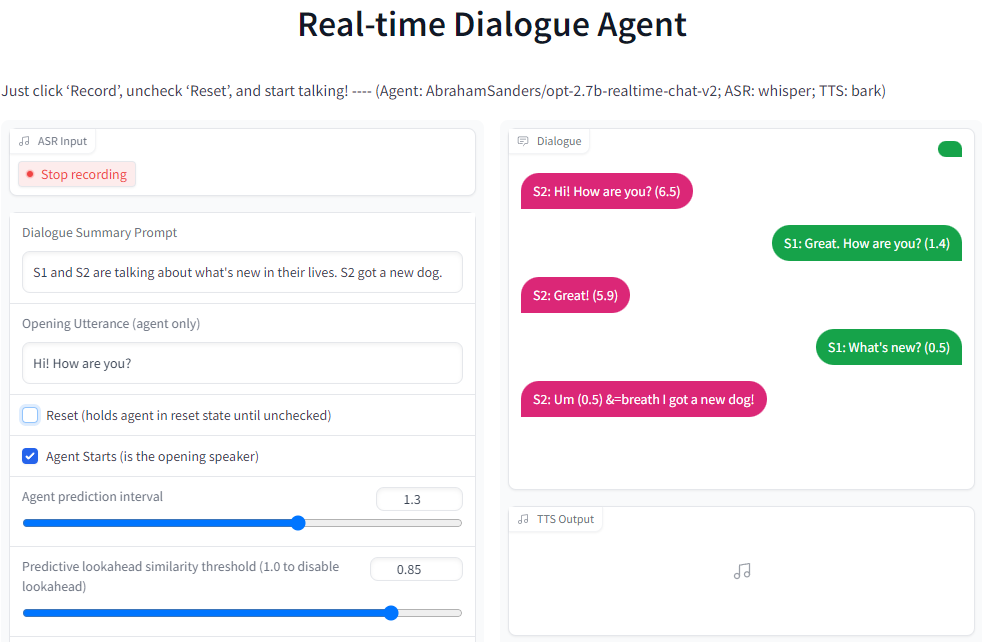
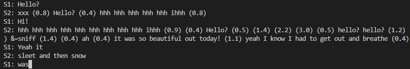

# realtime-chatbot
**A real-time, full-duplex conversational agent with incremental speech processing and continuous, non-hardcoded turn-taking behavior.**

Inspired by [Google Duplex](https://ai.googleblog.com/2018/05/duplex-ai-system-for-natural-conversation.html), this bot aims to provide an experience as close as possible to a live phone call or face-to-face conversation. Unlike Google Duplex which was designed
for specific tasks, this is a completely open-domain system intended to converse about anything. Importantly, there are no pre-defined
turn-taking rules - the agent is free to speak whenever it chooses and learns coordination behavior directly from the training data.

- [OpenAI Whisper](https://github.com/openai/whisper) is used for Automatic Speech Recognition (ASR).
- Meta's OPT 2.7b fine-tuned on transcribed spoken dialogue from [TalkBank](https://ca.talkbank.org/access/) is used for the dialogue agent. See the [model card](https://huggingface.co/AbrahamSanders/opt-2.7b-realtime-chat) for more details.
- [Meta's FastSpeech2](https://huggingface.co/facebook/fastspeech2-en-200_speaker-cv4) trained on [Common Voice v4](https://commonvoice.mozilla.org/en/datasets) is used for Text to Speech (TTS).



## Installation
### Dependencies
Python 3.8 or greater is required. If PyTorch is not already installed in your environment, please install 
the appropriate configuration of PyTorch for your environment (OS, CUDA version) before proceeding - 
see [https://pytorch.org/get-started/locally/](https://pytorch.org/get-started/locally/).

To clone the repo and install dependencies, run:
```bash
git clone https://github.com/AbrahamSanders/realtime-chatbot.git
cd realtime-chatbot
pip install -r requirements.txt
```

## Run Chat Interfaces
### Gradio Web Interface (audio + text)
To launch the Gradio web interface, run:
```bash
python run_gradio.py
```
Then, navigate to [http://127.0.0.1:7860](http://127.0.0.1:7860). 

Running this interface will use between 16GB and 24GB of GPU RAM, depending on the selected Whisper model size.
If you have multiple GPUs, the system will attempt to distribute the models across devices. This makes it possible to run
the system on a machine with two 16GB GPUs - one will run the agent (OPT 2.7b) and the other will run Whisper and FastSpeech2.
On a machine with three or more GPUs, OPT, Whisper, and FastSpeech2 will each run on their own dedicated GPU to maximize performance.

Audio input and output devices (microphone + speakers) are required. For the best experience it is recommended to use:

- A high-quality headset.
- Alternatively, headphones and an external microphone.



### Terminal Interface (text only)
To launch the terminal interface, run:
```bash
python run_chat.py
```
Running this interface will use between 12GB and 15GB of GPU RAM and should run smoothly on a machine with a single 16GB GPU.

Keyboard input into the terminal input is processed in real-time to emulate continuous speech input.
While you type, words are submitted to the agent after `space` or `enter` are pressed.

- Type `--reset` to clear the dialogue history and start over.
- Type `--exit` to quit.



### Training
To train an agent model, first prepare the dataset and then run the HuggingFace trainer. Scripts are provided for both.

#### Prepare the dataset
This script downloads, pre-processes and formats talkbank conversational corpora into text files for training, also handling separation into train, dev, and test splits. Simply run:
```bash
python prep_datast.py
```
The dataset files will be placed into the `data` folder.

It is also possible to specify individual talkbank corpora or change the default train/dev/test split. To do this, check the 
command line options:
```bash
python prep_datast.py --help
```

#### Train an agent model
The [train.py](train.py) script is a modified copy of [HuggingFace's run_clm.py script](https://github.com/huggingface/transformers/blob/v4.24.0/examples/pytorch/language-modeling/run_clm.py), adapted to use with line-by-line text file datasets that require 
padding each example instead of chunking them into fixed size blocks.

The provided shell script [train_large.sh](train_large.sh) is pre-configured to fine-tune `facebook/opt-2.7b` using `train.py`. 
To fine-tune a different model, simply modify this script. For example to train `facebook/opt-350m` instead, modify it as such:

```bash
python train.py \
    --model_name_or_path=facebook/opt-350m \
    ...
```